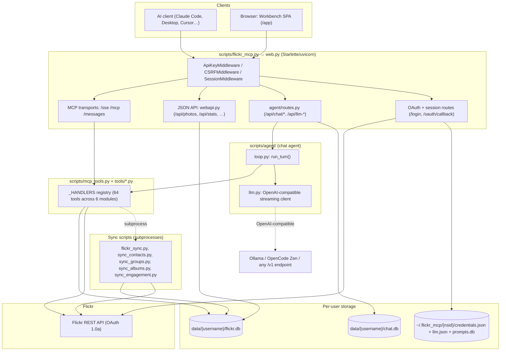

# Architecture

Technical reference for how this repository is put together. For setup and
usage, see [readme.md](readme.md) and [usage.md](usage.md). For the full list
of MCP tools, see [TOOLS.md](TOOLS.md). For the Workbench SPA specifically,
see the dedicated section near the end of this document plus
[WORKBENCH.md](WORKBENCH.md) (build history) and
[MODEL_CONFIG.md](MODEL_CONFIG.md) (LLM settings reference).

## Overview

One Starlette/uvicorn process serves four things on one port:

1. **MCP endpoints** (`/sse`, `/mcp`, legacy `/messages`) — the tool surface
   AI clients (Claude Code, Claude Desktop, Cursor, etc.) connect to.
2. **A JSON API** (`/api/*`) — backs the Workbench single-page app.
3. **The Workbench SPA** (`/app`) — a React app served as static files,
   giving a browser-based alternative to a terminal + MCP client.
4. **OAuth + session routes** (`/login`, `/oauth/callback`, `/logout`) — the
   only server-rendered (Jinja2) pages left; everything else moved into the
   SPA (see "The Workbench" below).

Everything hangs off one `mcp.server.Server("flickr")` instance
(`scripts/mcp_tools.py`). Both the MCP transports and the in-process chat
agent (used by the Workbench) dispatch through the *same* tool handler
registry, so a tool implemented once is usable from an AI client, from the
Workbench chat panel, and (for read-only data) from the JSON API.



## Directory map

```
scripts/
  flickr_mcp.py     — process entry point: env load, DB migrations, transport dispatch
  web.py            — Starlette app, OAuth flow, sessions, middleware, route table
  webapi.py         — JSON API for the Workbench SPA
  mcp_tools.py       — MCP Server instance, tool aggregation, call_tool dispatch
  db.py             — SQLite connection helpers, per-user path resolution, settings registry
  flickr_api.py      — OAuth 1.0a signing, credential storage, _api_get/_api_post
  flickr_oauth.py     — legacy terminal OAuth flow (superseded by web.py's browser flow)
  flickr_sync.py     — photo sync + schema/migrations (init_db, _MIGRATIONS)
  sync_contacts.py, sync_groups.py, sync_albums.py, sync_engagement.py
                     — the other four sync scripts, one per domain
  tools/             — MCP tool implementations, one module per domain
    photos.py, albums.py, groups.py, contacts.py, galleries.py, sync.py
  agent/             — server-side chat agent (Workbench "Chat" panel)
    loop.py, llm.py, schema.py, routes.py, settings.py, store.py,
    prompts_store.py, commands.py
frontend/            — Workbench SPA (React + TypeScript + Vite + dockview)
  src/App.tsx, MobileLayout.tsx, CommandPalette.tsx, panelDefs.ts, api.ts, bus.ts
  src/panels/         — one component per dockable panel
templates/            — Jinja2 templates for the surviving server-rendered pages (login, base)
static/                — favicon, legacy CSS (mostly superseded by frontend/src/styles.css)
tests/                 — pytest suite (~140 tests): tools, web, webapi, agent, transport, stdio
data/{username}/       — per-user SQLite: flickr.db, chat.db (Docker volume: flickr-data)
~/.flickr_mcp/{nsid}/  — per-user credentials.json, llm.json, prompts.db (Docker volume: flickr-creds)
```

## Multi-user model

Every Flickr account that completes OAuth login becomes an independent user:

- **Credentials**: `~/.flickr_mcp/{nsid}/credentials.json` — OAuth token,
  token secret, and a randomly-generated `mcp_api_key` (mode `0o600`, in a
  `0o700` directory). A legacy flat path (`~/.flickr_mcp/credentials.json`)
  is supported as a fallback for single-user installs and test patching.
- **Database**: `data/{username}/flickr.db` — created on first sync.
- **Chat history**: `data/{username}/chat.db` — kept separate from
  `flickr.db` so the "Reset Database" action (which deletes `flickr.db`)
  doesn't wipe conversations.
- **LLM settings + prompts**: `~/.flickr_mcp/{nsid}/llm.json` and
  `prompts.db` — kept next to credentials rather than in the data dir for
  the same reason: they should survive a database reset.

A `contextvars.ContextVar` (`db._current_user`) carries the active user
through a request without threading it through every function signature:

- The **MCP path**: `ApiKeyMiddleware` (in `web.py`) validates the
  `X-API-Key`/`Authorization: Bearer` header against an in-memory registry
  (`_api_key_registry`, populated at startup and refreshed after every
  login) and stashes the resolved NSID on `request.state.user_nsid`. The
  `_SSEHandler` / `_StreamableHTTPHandler` then read that state and call
  `_db_current_user.set(...)` for the lifetime of the connection.
- The **browser path**: session cookie (`user_nsid`, `username`, `fullname`,
  30-day expiry) set at OAuth callback time. `webapi.py` and `agent/routes.py`
  read the session directly (`_session_user`) rather than going through the
  ContextVar, since those handlers already know the user from the request.

`db.get_db()` and `flickr_api._load_credentials()` both resolve paths from
this ContextVar when no explicit user is passed, so tool handler code never
has to know whether it's running under stdio (single user), SSE (multi-user
via API key), or the JSON API (multi-user via session).

## Data layer

Each user's `flickr.db` (schema created by `flickr_sync.py:init_db`):

| Table | Purpose |
|---|---|
| `photos` | Metadata cache: title, description, tags, views, favorites, comments, dates, URLs, `is_public`, `synced_at` |
| `contacts` | People you follow: username, realname, `is_friend`/`is_family` |
| `contact_engagement` | Per-contact faves + comments on your photos |
| `do_not_unfollow` | Unfollow-candidate whitelist |
| `never_follow` | Follow-candidate exclusion list |
| `groups` | Joined groups: name, members, pool_count, description, user_note, needs_summary, summary_md, is_milestone, fave_min, view_min, open_subject, ai_keywords, summary_generated_at |
| `albums` | Photosets: title, description, primary photo, counts |
| `photo_groups` | Junction table: which of your photos are in which groups |
| `sync_log` | History of sync runs: type, mode, photos fetched, duration |
| `pending_group_adds` | Queue for rate-limited or scheduled group-pool adds (see below) |
| `settings` | Per-user key/value overrides for the registry in `db.SETTINGS_DEFAULTS` |
| `keeper_list` | Photos flagged as worth keeping despite weak stats |

**Migrations** (`flickr_sync.py:_MIGRATIONS`) are a flat, ordered list of SQL
statements applied via `PRAGMA user_version` as a cursor — never `ALTER
TABLE` run ad hoc. `_apply_migrations()` runs any migration whose index
exceeds the stored version, commits, and bumps the version, so a crash
mid-migration can't leave the schema half-applied silently. Every user's DB
is migrated at process startup (`flickr_mcp.py:_migrate_all_user_dbs`) so
schema changes take effect even for users who haven't synced since the
upgrade.

## Sync pipeline

Five standalone scripts, each runnable directly or spawned as a subprocess
by the server:

| Script | Domain |
|---|---|
| `flickr_sync.py` | Photos — incremental (since last sync), `--full` (re-fetch everything), or `--backfill` (walk date-range windows; the only way to reach photos beyond the ~4000-item pagination ceiling) |
| `sync_contacts.py` | Contacts you follow |
| `sync_groups.py` | Group membership |
| `sync_albums.py` | Albums (photosets) |
| `sync_engagement.py` | Per-contact faves/comments on your photos |

`tools/sync.py` provides the shared subprocess infrastructure:

- **Per-user locking** — `_get_user_lock(username)` gives each user an
  independent `asyncio.Lock`; one user's long sync never blocks another's,
  but a user's own syncs are serialized so two processes never write the
  same SQLite file concurrently.
- **`_run_sync_script`** — spawns the subprocess, streams its stdout to the
  server log, and records `duration_seconds` back into `sync_log`.
- **`_background_refresh`** — runs forever in the main event loop, checking
  every 10 minutes whether each registered user is due. Each user gets a
  stable random threshold between 2h and 12h (seeded by their last sync
  timestamp, so it doesn't jitter between checks); anyone past 12h always
  refreshes. On every wake it also flushes any due items in the group-add
  queue (see below), independent of whether a full sync is due.
- Triggered from three places with identical shape: the `sync` MCP tool,
  the JSON API (`POST /api/sync/{type}`), and the background loop.

**Group-add queue** (`pending_group_adds`): `add_to_group` can hit Flickr's
daily per-group posting limit, or the caller can deliberately schedule a
future add (`queue=true`, `retry_at=morning`, `days_offset=2` for
drip-posting). Either way the attempt lands in this table with a
`retry_after` timestamp; `_flush_group_queue` (in `tools/groups.py`) is
called from the background loop, from `get_group_queue`, and from the
Workbench Queue panel's "retry" actions, and posts anything whose retry
window has passed.

**Group AI summary** (`groups.needs_summary`): `sync_groups.py` runs in two
phases. Phase one (`sync_groups()` + `sync_group_descriptions()`) diffs
Flickr's current group list and each group's description against the local
DB and sets `needs_summary=1` whenever a group is **new**, **renamed**, or
its **description changed** — Flickr exposes no last-modified marker for
group info, so every joined group's description is re-fetched and compared
each sync to catch this. Editing a group's `user_note` via the
`set_group_note` tool also sets `needs_summary=1` directly. Phase two
(`sync_group_summaries()`) then calls the flagged groups' summaries through
the user's configured LLM (`resolve_sync_cfg()` — see
[MODEL_CONFIG.md](MODEL_CONFIG.md#sync-jobs-model-selection)), paced by
`sync_throttle_seconds` (default 60s, gentle on a local LLM), regenerating
`summary_md`, `is_milestone`, `fave_min`, `view_min`, `open_subject`, and
`ai_keywords` from the group's name/description/user_note and the editable
`group-summary` prompt (`agent/prompts_store.py`).

## MCP tool layer

`scripts/mcp_tools.py` aggregates six domain modules under `scripts/tools/`
into one registry:

```python
_ALL_MODULES = [photos, albums, groups, contacts, galleries, sync_tools]
_HANDLERS: dict = {}   # tool name -> async handler
for _mod in _ALL_MODULES:
    _HANDLERS.update(_mod.HANDLERS)
```

Each module exports `TOOLS` (a list of `mcp.types.Tool` — name, description,
JSON Schema `inputSchema`) and `HANDLERS` (name → async function). See
[TOOLS.md](TOOLS.md) for the full catalog (64 tools as of this branch).

**Threading model** (`call_tool` in `mcp_tools.py`): the `sync` tool family
uses asyncio subprocesses and per-user locks that must stay bound to the
main event loop, so those handlers run in-place. Every other handler does
blocking SQLite/HTTP work, so it's dispatched via
`asyncio.to_thread(lambda: asyncio.run(handler(args)))` — one slow tool call
can't stall the shared event loop for every other connected session.
`contextvars` context (including `_current_user`) is copied into the worker
thread automatically, so per-user resolution keeps working there.

**Transports** (registered in `web.py:main_sse`):
- `/sse` + `/messages/` — classic SSE transport (`SseServerTransport`),
  gated by `ApiKeyMiddleware`.
- `/mcp` — Streamable HTTP transport, stateless per request
  (`StreamableHTTPServerTransport(mcp_session_id=None)`), also gated by
  `ApiKeyMiddleware`.
- stdio (`MCP_TRANSPORT=stdio`, `flickr_mcp.py:main_stdio`) — for a single
  user identified by the `MCP_API_KEY` environment variable, used by the
  Docker stdio config shown on the Setup panel.

## JSON API (`webapi.py`)

Backs the Workbench SPA with structured JSON instead of the MCP text
protocol, reading the per-user database directly with `get_db_for_user`
(bypassing the MCP handler layer) so responses can be typed for the
frontend. Auth is the browser session cookie; POSTs carry the session's
CSRF token via an `X-CSRF-Token` header (see Security below). Endpoints
cover photos (list/detail/fave/comment), albums, stats, sync
status/trigger, the group-add queue, setup snippets, settings, API key
regeneration, database reset, and the downloadable browser extension. Photo
detail (`GET /api/photos/{id}`) is always assembled live from the Flickr API
(`_build_photo_detail`) — core metadata, sizes, favorites, and album/group
membership all come straight from Flickr so the detail view never shows stale
cached values; only the keeper-list flag, a local-only annotation, is read
from the per-user database.

## Web/auth layer (`web.py`)

- **OAuth 1.0a browser flow**: `/login/start` requests a token, redirects to
  Flickr's authorize page; `/oauth/callback` exchanges the verifier for an
  access token, writes `credentials.json`, updates the API key registry,
  sets the session, and kicks off a background first-sync
  (`_post_login_sync`).
- **Sessions**: `SessionMiddleware` with a signing key persisted at
  `~/.flickr_mcp/session_secret.key` (or `SESSION_SECRET_KEY` env var),
  30-day expiry. Logging out only clears the session — credentials and the
  database are untouched.
- **CSRF**: `CSRFMiddleware` skips MCP paths, checks an `X-CSRF-Token`
  header against the session for `/api/*` POSTs, and checks a form field for
  the (few remaining) traditional form posts.
- **Static caching**: `StaticCacheMiddleware` gives `/app/assets/*`
  (content-hashed by Vite) an immutable long-lived cache header, while
  `/app/*` itself (the unhashed `index.html` shell) gets `no-cache` so a
  rebuild doesn't leave browsers pinned to a stale bundle.

## The Workbench

**Mr. E's Photo Workbench** is the browser-based alternative to running an
AI client's terminal next to a Flickr browser tab: one page, `/app`,
combining a photo browser, stats, sync controls, and an LLM chat agent that
can call every MCP tool directly.

**Frontend** (`frontend/`, React + TypeScript + Vite): a
[dockview](https://dockview.dev/) multi-panel shell (`App.tsx`) with panels
for Photo Browser, an "Other's Photo" viewer, Summary, Chat, Commands,
Models, Prompts, Sync, Queue, Setup, and Settings — each panel is a React
component under `frontend/src/panels/`, registered once in
`frontend/src/panelDefs.ts` so the dockview shell, the mobile layout, and
the Ctrl/Cmd-K command palette (`CommandPalette.tsx`) all share one
definition. Layout is persisted to `localStorage`; a `useIsMobile` hook
switches to a two-pane `MobileLayout` under 768px. The Vite build outputs to
`frontend/dist`, built in a Node stage of the Dockerfile and mounted at
`/app` only when that directory exists — the classic server-rendered pages
it replaced (`home.html`, `stats.html`, `sync.html`, `queue.html`,
`setup.html`, `settings.html`) have been deleted.

**Chat agent** (`scripts/agent/`): an LLM loop over the *same* `_HANDLERS`
registry the MCP transports use — no MCP protocol involved, just direct
in-process calls (`loop.py:_execute_tool`). Key pieces:

- `schema.py` converts `mcp.types.Tool` definitions to OpenAI function-calling
  format and defines `WRITE_TOOLS` — every tool that mutates Flickr or local
  state.
- `llm.py` is a minimal streaming client for any OpenAI-compatible
  `/chat/completions` endpoint (Ollama by default, or a configured remote
  provider like OpenCode Zen).
- `loop.py:run_turn` streams one user turn as typed SSE-ready events
  (`delta`, `tool_call`, `confirm_request`, `tool_result`, `focus`, `error`,
  `done`). Every call to a `WRITE_TOOLS` member pauses the generator on an
  `asyncio.Future` until the frontend posts an approve/deny to
  `/api/chat/confirm` — the model can propose a mutation but never executes
  one unattended. A `vision` setting gates whether `fetch_photo_image`
  results actually reach the model as image content, or get replaced with a
  disclaimer (to stop a non-vision model from confidently hallucinating a
  description).
- `settings.py` stores per-user provider profiles and sampling parameters at
  `~/.flickr_mcp/{nsid}/llm.json`; `store.py` persists conversations
  (OpenAI wire-format messages) to `data/{username}/chat.db`, including the
  provider/model active when each conversation started.
- `prompts_store.py` + `commands.py` back the **Prompts** and **Commands**
  panels: user-editable prompt templates (with `{photo_id}`/`{user_nsid}`
  placeholders) become one-click workflow buttons, adapted from the
  original `.claude/commands/flickr-*` skills.
- `routes.py` wires all of the above into Starlette routes: `/api/chat/stream`
  (SSE), `/api/chat/confirm`, conversation CRUD, `/api/llm-settings`,
  `/api/llm-models`, `/api/commands`, and the prompt/category/variable CRUD
  endpoints.

See [MODEL_CONFIG.md](MODEL_CONFIG.md) for the full LLM settings reference
and [WORKBENCH.md](WORKBENCH.md) for the milestone-by-milestone build log.

## Security summary

- OAuth 1.0a request signing is hand-rolled (`flickr_api._sign`,
  HMAC-SHA1) — no third-party OAuth library.
- Credentials and the session-signing key are written with `0o600`
  permissions inside `0o700` directories.
- MCP transports require a per-user API key; the JSON API and chat agent
  require a session cookie plus a matching CSRF token on every POST.
- `db.like_pattern` escapes `%`, `_`, and `\` before building `LIKE`
  clauses, paired with `ESCAPE '\'`, so user-supplied search text can't act
  as SQL wildcards.
- Write-tool calls from the chat agent always pause for explicit user
  approval; MCP-connected AI clients rely on the client's own tool-approval
  UI instead, since the MCP protocol has no equivalent confirmation step.

## Testing

`pytest` (`tests/`, ~140 tests): `test_tools.py` (MCP tool handlers),
`test_web.py` / `test_webapi.py` (Starlette routes and the JSON API),
`test_agent.py` (schema conversion, the streaming loop, confirm/deny,
vision gating, focused-photo context), `test_transport.py` (SSE/streamable
HTTP wiring), `test_stdio.py` (stdio transport), `test_sync.py` (migrations
and sync scripts). `tests/conftest.py` provides shared fixtures (temp
per-user DBs, patched credentials).

## Deployment

Single multi-stage `Dockerfile`: a `node:22-alpine` stage builds the
frontend (`npm ci && npm run build`) into `frontend/dist`, then a
`python:3.14-slim-bookworm` stage installs `requirements.txt`, copies
`scripts/`, `templates/`, `static/`, and the built frontend, and runs as a
non-root `app` user. `docker-compose.yml` mounts two named volumes:
`flickr-data` (`/app/data`, per-user SQLite) and `flickr-creds`
(`/home/app/.flickr_mcp`, per-user credentials/settings) so both survive a
container rebuild.
